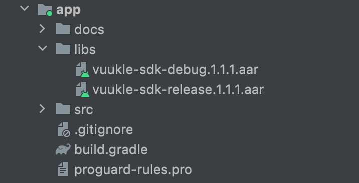

### **Implement Vuukle SDK for Android**

1. Add **vuukle-sdk-debug.1.1.1.aar** or **vuukle-sdk-release.1.1.2.aar**  to
   project **/app/libs**.

   

 2. Include Vuukle SDK in **build.gradle**

    ```kotlin
    // Vuukle SDK
    implementation files('libs/vuukle-sdk-debug.1.1.2.aar')
    ```

    or

    ```kotlin
    // Vuukle SDK
    implementation files('libs/vuukle-sdk-release.1.1.2.aar')
    ```

 3. Add **apikey. properties** file to project

    ```properties
    PUBLISHER_PUBLIC_KEY="664e0b85-5b2c-4881-****-********"
    PUBLISHER_PRIVATE_KEY="bd3a64e4-7e19-46b2-****-********"
    ```

 4. Add permission in **AndroidManifest.xml**

    ```xml
    <uses-permission android:name="android.permission.INTERNET" />
    ```


 5. Define **VuukleView** in layout XML

    ```xml
     <RelativeLayout
            android:layout_width="match_parent"
            android:layout_height="match_parent"
            android:orientation="vertical">

            <com.vuukle.webview.widget.VuukleView
                android:id="@+id/commentsView"
                android:layout_width="match_parent"
                android:overScrollMode="never"
                android:layout_height="match_parent"
                android:layout_marginTop="90dp"
                android:scrollbars="none" />

            <com.vuukle.webview.widget.VuukleView
                android:id="@+id/shareBarView"
                android:layout_width="match_parent"
                android:layout_height="90dp" />

        </RelativeLayout>
    ```

 6. Initialize **VuukleManager** in activity onCreate() function

    ```kotlin
    override fun onCreate(savedInstanceState: Bundle?) {
        
          	super.onCreate(savedInstanceState)
        	
        	setContentView(R.layout.activity_view_pager)
        	// Initilize vuukle manager
            VuukleManager.init(this)
    
    }
    
    ```


 7. Create **VuukleManager** instance and load

    ```kotlin
    private fun createVuukleManager() {
    
            // Create Vuukle manager instance
            vuukleManager = VuukleManager.Builder(LifecycleOwner).build()
    
            // Error handling
            vuukleManager.addErrorListener(object : VuukleErrorListener {
                override fun onError(exception: VuukleException) {
                    Toast.makeText(this@SampleActivity, exception.message.toString(), Toast.LENGTH_LONG).show()
                }
            })
    
            // load comments in VuukleView
            vuukleManager.load(commentsView, VuukleConstants.COMMENTS_URL)
            // load share bar in VuukleView
            vuukleManager.load(shareBarView, VuukleConstants.SHARE_BAR_URL)
    
            // Handle vuukle events
            // If you did not set event listener by default all events will be handled by VuukleManager
            vuukleManager.setEventListener(object : VuukleEventListener {
                override fun onNewEvent(event: VuukleEvent) {
                    when(event){
                        is VuukleEvent.TownTalkClickEvent -> { /* Handle */ }
                        is VuukleEvent.YouMindLikeClickEvent -> { /* Handle */ }
                    }
                }
            })
        }
    ```

    

8. SSO  functionality

   ```kotlin
    private fun initSSOFunctionality() {
   
           // Add custom SSO listener
           vuukleManager.addCustomSSOEventListener(object : SSOEventListener {
               override fun onSignInClicked() {
                   // Overriding SSO Sign in button click
               }
           })
   
           // Handle on login click
           loginSSOButton.setOnClickListener {
               // Login user by SSO using email and username
               vuukleManager.loginBySSO("test@gamil.com", "testUserName")
           }
   
           // Handle on logout click
           logoutSSOButton.setOnClickListener {
               // Logout user
               vuukleManager.logout()
           }
   }
   ```

   

9. Include Facebook SDK for Facebook functionality

   9.1  implementations to **build.gradle**

   ```kotlin
   implementation 'com.facebook.android:facebook-login:12.0.0'
   implementation 'com.facebook.android:facebook-share:12.0.0'
   ```

   

   9.2 add **facebook_app_id** and **facebook_client_token** in **strings.xml**

   ```xml
   <string name="facebook_app_id">20036321******</string>
   <string name="facebook_client_token">e9153a0f8194d413**************</string>
   ```

    To get your app_id and client_token check  [Facebook documentation](https://developers.facebook.com/docs/facebook-login/android/)

   9.3 add meta-data in **AndroidManifest.xml**

   ```xml
   <meta-data
   	android:name="com.facebook.sdk.ApplicationId"
   	android:value="@string/facebook_app_id" />
   
   <meta-data
   	android:name="com.facebook.sdk.ClientToken"
   	android:value="@string/facebook_client_token"/>
   ```

   

   9.4 add **FacebookContentProvider** in **AndroidManifest.xml**

   ```xml
   <provider
    	android:name="com.facebook.FacebookContentProvider"
    	android:authorities="com.facebook.app.FacebookContentProvider[facebook_app_id]"
       android:exported="false" />
   ```


   
